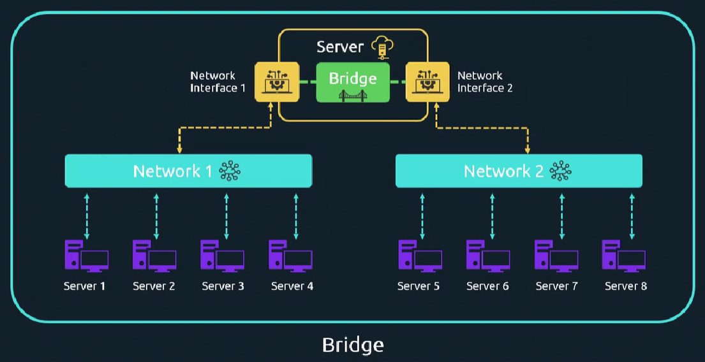
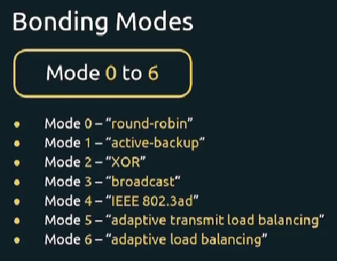

### Bridge

Предположим у нас есть сервер с двумя интерфейсами, подключенными к разным сетям. Мы можем объединить два интерфейса в мост (bridge), чтобы хосты из разных сетей могли взаимодействовать друг с другом. Например Server1 таким образом сможет достучаться до Server8.

Мост в Linux позволяет объединить две сети вместе, равно как настоящий мост соединяет два куска суши.

Фактически с помощью моста можно объединить и более двух сетей.

 

### Bonding

 

- Mode 0 - "round-robin", интерфейсы используются поочередно
- Mode 1 - "active-backup", активен только один интерфейс
- Mode 2 - "XOR", выбор на основе source и destination пакета, для каждой пары source и destination всегда используется один и тот же интерфейс
- Mode 3 - "broadcast", данные отправляются одновременно через оба интерфейса
- Mode 4 - "IEEE 802.3ad" - повышает производительность передачи трафика по сравнению с использованием одного интерфейса
- Mode 5 - "adaptive transmit load balancing" - данные отправляются через наименее загруженный интерфейс бонда
- Mode 6 - "adaptive load balancing" - попытка балансировать и входящий и исходящий трафик
