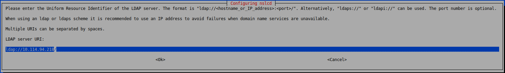
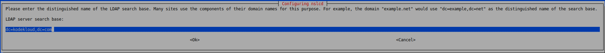
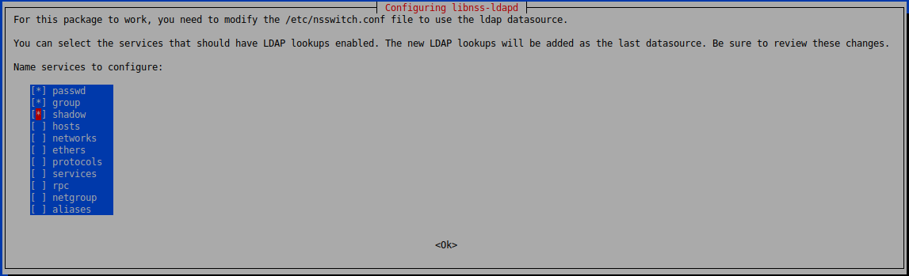
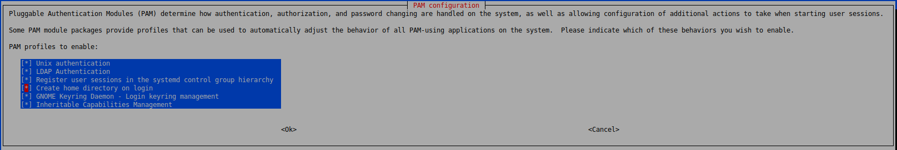

Устанавливаем LXD: `sudo snap install lxd`.

Инициализируем LXD: `lxd init`. Везде жмем Enter (дефолтные значения), проверяем что в секции `Size in GiB of the new loop device (1GiB minimum)` выставлено минимум `5GiB`.

Скачиваем архив с LDAP-сервером по ссылке: `wget https://public-kodekloud-course-assets.s3.amazonaws.com/ldap-server.tar.xz`.

Импортируем архив: `lxc import ldap-server.tar.xz`.

Запускаем контейнер: `lxc start ldap-server`.

Смотреть статус контейнеров: `lxc list`. Из вывода этой команды получаем IPv4-адрес контейнера.

Ставим пакет: `sudo apt update && sudo apt install libnss-ldapd`. После его установки запустится псевдографический интерфейс для настройки.

 

 

 

В процессе установки пакета будет модифицирован файл `/etc/nsswitch.conf`.

Также при необходимости можно менять настройки в файле `/etc/nslcd.conf`.

Получить информацию обо всех учетных записях в системе, включая LDAP-ные: `getent passwd`. Здесь `getent = get_entries`.

Получить информацию только о LDAP-учетках, имеющихся в системе: `getent passwd --service ldap`.

Получить информацию о LDAP-группах, имеющихся в системе: `getent group --service ldap`.

Включаем автоматически создание home-каталога LDAP-пользователя: `sudo pam-auth-update`.

 

Пробуем залогиниться под LDAP-пользователем: `sudo login john`. Вводим пароль пользователя john.

Видим, что home-каталог создался автоматически.