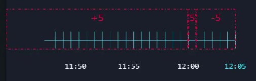

Общий синтаксис команды: `find [/path/to/directory] [search_parameters]`.

Искать файл с названием "file1.txt" в директории "/bin": `find /bin/ -name file1.txt`.

Если не указывать путь, то будет выполнен поиск в текущем каталоге: `find -name file1.txt`. При этом выполняется "case-sensitive" поиск.

Искать файл с названием `felix` иил `Felix` в текущей директории: `find -iname felix`. В данном случае это будет "case-insensitive" поиск.

Искать файлы с расширением ".jpg": `find /usr/share -name '*.jpg'`.

Искать файлы начинающиеся на букву "f": `find -name "f*"`.

Искать файлы размером ровно 512 Кб: `find -size 512k`. Возможные опции: `c = bytes`, `k = kilobytes`, `M = megabytes`, `G = gigabytes`.

Искать файлы размером более 10Мб: `find /lib64 -size +10M`.

Искать файлы размером менее 10Мб: `find /lib64 -size -10M`.

 

Искать файлы измененные в течение последних 5 минут: `find /dev -mmin -5`. Здесь `mmin = modified minute`.

Искать файлы измененные более 5 минут назад: `find /dev -mmin +5`.

Искать файлы измененные 5 минут назад от текущего времени: `find /dev -mmin 5`, т.е. если сейчас 12:05, это значит искать файлы измененные с 12:00 до 12:01.

Искать файла измененные за последние сутки: `find -mtime 0`. Здесь `0 = последние 24 часа`, `1 = последние 24-48 часов` и т.д.

"Modification" означает создание либо изменение файла. В Linux также существует понятие "change time", которое звучит похоже на "modified time", но на самом деле это разные понятия. "Modified time" относится ко времени изменения содержимого файла, а "change time" относится ко времени изменения метаданных файла (например file permissions). Таким образом "modified time" != "change time".

Искать файлы, у которых были изменены permissions в течение последних 5 минут: `find -cmin -5`. Здесь `cmin = change minute`.

Искать файлы, в имени которых первая буква f и размером 512 Кб, оператор AND: `find -name "f*" -size 512k`.

Искать файлы, в имени которых первая буква f или размером 512 Кб, оператор OR: `find -name "f*" -o -size 512k`.

Искать файлы начинающиеся НЕ на букву f: `find -not -name "f*"`.

Искать файлы начинающиеся НЕ на букву f, альтернативный вариант: `find \! -name "f*"`. Восклицательный знак экранируется.

Искать файлы в точности с permissions 664: `find -perm 664`.

Искать файлы как минимум с permissions 664, если есть файлы с extra-permissions, то такие файлы тоже отразятся в результатах поиска: `find -perm -664`.

The use of the `-` option means "at least this permission level is set, and any higher permissions."

This example displays all resources in the current directory with at least 644 permissions.

Искать файлы у которых есть какие-либо из указанных permissions: `find -perm /664`. Если пользователь имеет права только на чтение, то это войдет в результат поиска.

# т.к. u=r и это входит
# The use of the / option means "any of the permissions listed are set."
# This example displays resources with 644 or greater permissions.

# Find files/directories under /var/log/ directory that the group can write to, but others cannot read or write to it.
# Permissions for the group have to be at least w. If there's also an extra r or x in there, it will still match.
# Permissions for others have not to be r or w. That means, if any of these two permissions, r or w match for others, the result has to be excluded.
# Ответ - sudo find /var/log/ -perm -g=w ! -perm /o=rw > /home/bob/data.txt
sudo find /var/ -name pets -type d   #искать только директории с именем pets
sudo find /usr -size +5M -size -10M -type f > /home/bob/size.txt   #искать файлы размером от 5 до 10 Мб
sudo find /opt/findme/ -perm -u=x -type f > /opt/foundthem.txt   #искать именно файлы (не папки), у которых у владельца есть как минимум права на execute
sudo find /opt/findme/ -not -perm /o=r   #искать файлы у которых для others нет разрешения на чтение
find /opt/findme/ -perm /4000 -exec rm -f {} \;   #искать файлы с установленным SUID и затем удалить их все
find /opt/findme/ -type f -size +1k -exec cp "{}" /opt/ \;   #искать файлы размером более 1 Кб и далее скопировать их в /opt
sudo find /home/bob/collection/ -type f -name "*.txt" -exec mv {} /opt/textfiles/ \;   #искать txt-файлы и переместить в папку 
sudo find /home/bob/collection/ -type f -user adm -exec cp {} /opt/admfiles/  \;   #искать файлы, у которых владелец adm и копировать в папку
sudo find ./collection/ -mmin -60 -type f -exec cp --target-directory=/opt/oldfiles/ {} +\;   #искать файлы, которые были изменены менее часа назад
# и копировать в папку

find /home/usersdata -type f -user kirsty -exec cp -p --parents {} /media/ \;   #parents - сохранить структуру папок при копировании

Искать файл по имени: `locate City.txt`.

Перед этим стоит обновить БД: `updatedb`.
