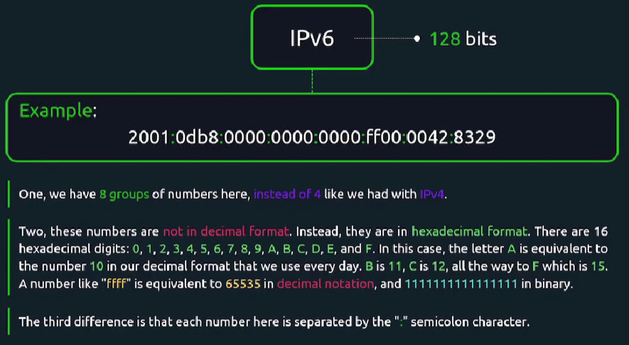
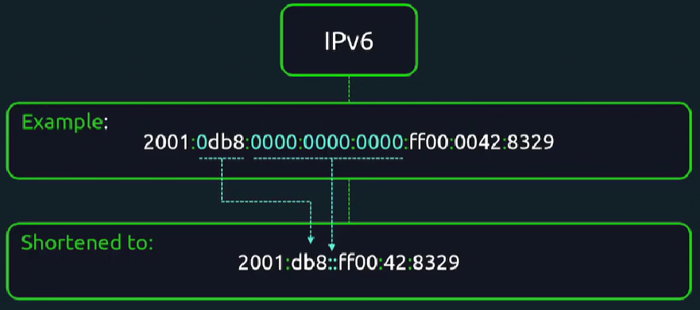
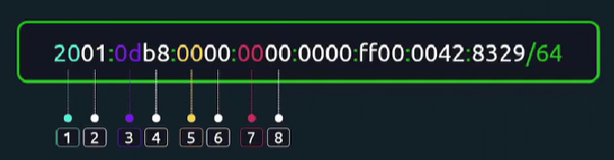

IPv4-адрес имеет длину 32 бит.

IPv6-адрес имеет длину 128 бит.

<br>

Нули в начале блоков IPv6-адреса сокращаются:

<br>

IPv6-адреса также поддерживают CIDR-нотацию.

<br>

Данная запись означает, что первые 64 бита относятся к маске подсети.

Каждая группа, состоящая из двух шестнадцатеричных чисел - это 8 бит.

`loopback`-интерфейс используется например, когда приложение подключается к БД, расположенной на том же хосте.

Можно "раскрасить" вывод стандартной команды `ip -c addr`.

Включить интерфейс: `sudo ip link set dev enp0s8 up`.

Добавить IPv4-адрес на интерфейс: `sudo ip addr add 192.168.1.10/24 dev enp0s8`. Аналогично можно добавить и IPv6-адрес.

Удалить IPv4-адрес на интерфейс: `sudo ip addr delete 192.168.1.10/24 dev enp0s8`.

Команды выше действуют только до рестарта ОС. После перезагрузки изменения будут потеряны.

Для управления настройками сети в Ubuntu существует пакет `netplan`. Команда `netplan get` покажет нам текущие настройки.

Каталог с конфигами `/etc/netplan`.

Пример конфига:

```yaml
network:
  ethernets:
    enp0s8:
      dhcp4: false
      dhcp6: false
      addresses:
        - 10.0.0.9/24
        - fe80::921b:eff:fe3d:abcd/64
  version: 2
```

После внесения изменений выполняем команду: `sudo netplan try`. Это попытка применить сделанные изменения. Если не будет получено подтверждение от пользователя в течении 120 секунд (нажатие клавиши Enter), тогда операция будет отменена.

Либо можно задать требуемый таймаут: `sudo netplan try --timeout 30`.

Создадим кастомный конфиг для другого интерфейса: `sudo vi /etc/netplan/99-mysettings.yaml`.

Существует стандартная практика указывать числовой префикс перед названием файла. Т.к. netplan обрабатывает файлы в каталоге `/etc/netplan` в алфавитном порядке, то наш кастомный конфиг будет обработан в последнюю очередь (при условии, что в этой директории нет файлов с еще большим числовым префиксом).

```yaml
network:
  ethernets:
    enp0s8:
      dhcp4: false
      dhcp6: false
      addresses:
        - 10.0.0.9/24
        - fe80::921b:eff:fe3d:abcd/64
      nameservers:
        addresses:
          - 8.8.4.4
          - 8.8.8.8
      routes:
        - to: 192.168.0.0/24
          via: 10.0.0.100
        - to: default
          via: 10.0.0.1
  version: 2
```

Применяем конфиг: `sudo netplan try --timeout 30`.

Смотреть маршруты: `ip route`.

Смотреть настройки DNS: `resolvectl status`. Увидим, что настройки применились к конкретному интерфейсу `enp0s8`.

Чтобы поменять настройки DNS глобально во всей системе идем в конфиг `/etc/systemd/resolved.conf`.

```
[Resolve]
DNS=1.1.1.1 9.9.9.9
```

Перезапускаем сервис: `sudo systemctl restart systemd-resolved.service`.

Смотреть настройки DNS в более компактном виде: `resolvectl dns`. Видим, что в выводе появилась секция `Global` с заданными dns-серверам.

Смотреть примеры настройки netplan: `man netplan`.

Плюс в каталоге `/usr/share/doc/netplan/examples` можно найти примеры конфигов.