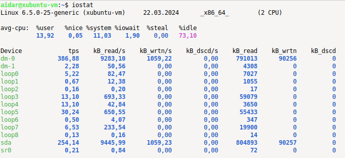
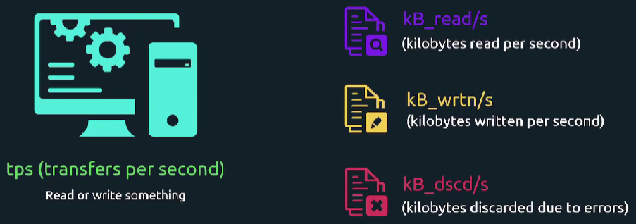

Для мониторинга производительности дисковой подсистемы нам понадобятся утилиты `iostat` и `pidstat`.

Они входят в состав пакета `sysstat`. Установим его: `sudo apt install sysstat`.

Рассмотрим вывод команды `iostat`.

 

Важно понимать, что утилита показывает "исторические" данные с момента последней загрузки системы. Т.е. любая представленная метрика рассчитывается как среднее значение. Например `kB_reads/s` - это общее количество "прочитанных" килобайт поделенное на время uptime сервера.

Предположим мы испытываем проблемы с дисковой подсистемой в течение последнего часа, а сервер работает уже две недели. Соответственно мы не увидим каких-либо значений, отражающих проблему. Т.к. это будет среднее значение с момента загрузки сервера до момент ввода команды.

Например сервер работает всего три секунды. Пример расчета метрики (значения представлены в виде "килобайт в секунду"):

 

Метрика `tps` (transfers per second) - сколько раз система сообщила устройству прочитать или записать что-либо.

 