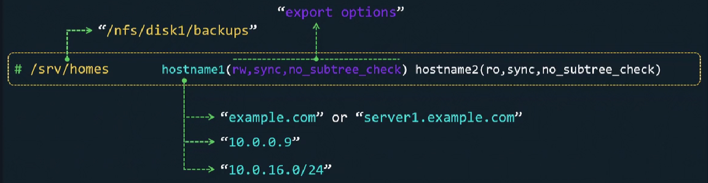
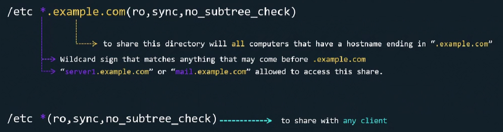

### Настройка NFS-сервера

Ставим пакет: `sudo apt install nfs-kernel-server`.

Редактируем конфиг: `sudo vim /etc/exports`. В левой части этого конфига указывается директория на NFS-сервере, которая будет доступна клиентам по сети для монтирования, в правой части перечисляются разрешенные для подключения клиенты и доступные им опции монтирования, которые могут отличаться для разных клиентов.

 

`sync` - синхронная запись данных. NFS убеждается, что записанные клиентом данные действительно сохранены на устройстве, прежде чем отправить подтверждение об успешной операции.

`async` - асинхронная запись данных. Клиент может сделать несколько запросов на запись и NFS ответит, что запись завершена еще до фактического сохранения данных на диск. Этот режим позволяет клиентам записывать изменения быстрее, но не гарантирует, что все они действительно сохранены на диск. Таким образом мы можем столкнуться с ситуацией, когда NFS-сервер ответил клиенту, что запись завершена, хотя фактически данные еще не записались на диск. Сервер неожиданно перезагружается, что приводит к потере данных об операции записи.

`no_subtree_check` - как правило мы хотим экспортировать всю файловую систему. Предположим у нас есть backup-диск на NFS-сервере и мы смонтировали его в `/nfs/disk1`. Затем мы сделали экспорт nfs-шары, включая некоторые подкаталоги `/nfs/disk1/backups/database`. Если опция `subtree_checking` включена, то NFS-сервер будет проверять, что запрашиваемый файл находится в определенной поддиректории, которую мы экспортировали, что может привести к некоторым проблемам, в случае если файл переименован или удален. Опция `subtree_checking` в основном предназначена для дополнительных проверок на безопасность, но имеет некоторые недостатки и последствия в плане производительности. Поэтому опция `no_subtree_check` по умолчанию применяется ко всем nfs-экспортам.

В некоторых случаях приходится экспортировать не весь раздел, а лишь его часть. При этом сервер NFS должен выполнять дополнительную проверку обращений клиентов, чтобы убедиться в том, что они предпринимают попытку доступа лишь к файлам, находящимся в соответствующих подкаталогах. Такой контроль поддерева (subtree checks) несколько замедляет взаимодействие с клиентами, но если отказаться от него, могут возникнуть проблемы с безопасностью системы.

`no_root_squash` - позволяет пользователю `root` на nfs-клиенте иметь `root`-привилегии на удаленной nfs-шаре. По умолчанию NFS "подавляет" `root`-привилегии. Это значит, что даже если мы являемся пользователем `root` в свой локальной системе и монтируем nfs-шару, то все равно не сможем выполнять чтение/запись как `root` на удаленной файловой системе, а будем "понижены" до привилегий обычного пользователя. Все запросы на чтение/запись от пользователя `root`, выполненные с клиента, будут смаплены на пользователя `nobody` на nfs-сервере. Это своего рода мера безопасности.

Смотреть справку по nfs-экспортам: `man exports`.

Создадим свой nfs-экспорт, добавив в конфиг `/etc/exports` строку: `/etc 127.0.0.1(ro)`.

Скажем nfs-серверу перечитать конфигурацию об экспортах: `sudo exportfs -r`. Опция `-r` означает "re-export".

Посмотрим итоговую информацию об экспортах: `sudo exportfs -v`. Опция `-v` означает "verbose".

Результат:

`/etc          	127.0.0.1(sync,wdelay,hide,no_subtree_check,sec=sys,ro,secure,root_squash,no_all_squash)`

 

### Настройка NFS-клиента

Ставим необходимы пакет: `sudo apt install nfs-common`.

 

Смонтируем: `sudo mount 127.0.0.1:/etc /mnt`.

Отмонтировать: `sudo umount /mnt`.

Если мы хотим, чтобы данная nfs-шара автоматически монтировалась при старте системы, то нужно добавить в `/etc/fstab` строку:

`127.0.0.1:/etc /mnt nfs defaults 0 0`