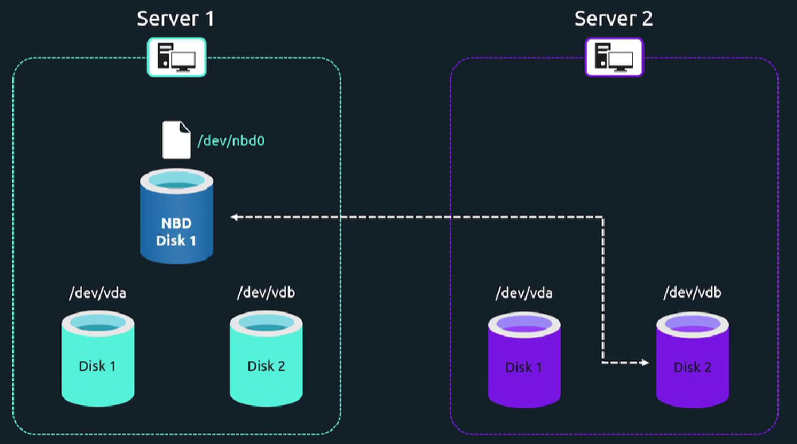

При использовании NBD на Server 1 создается блочное устройство `/dev/nbd0`, которое фактически ссылается на диск `/dev/vdb` на удаленном хосте Server 2. Таким все запросы на чтение/запись, приходящие на устройство `/dev/nbd0` будут перенаправляться на диск `/dev/vdb` на удаленном хосте.

<br>

### Настройка сервера

Ставим пакет: `sudo apt install nbd-server`.

Редактируем конфиг: `sudo vim /etc/nbd-server/config`.

```
[generic]
# If you want to run everything as root rather than the nbd user, you
# may either say "root" in the two following lines, or remove them
# altogether. Do not remove the [generic] section, however.
#        user = nbd
#        group = nbd
        includedir = /etc/nbd-server/conf.d
        allowlist = true

# What follows are export definitions. You may create as much of them as
# you want, but the section header has to be unique.
[partition1]
  exportname = /dev/sda3
```

По умолчанию демон `nbd-server` работает из-под пользователя `nbd`, у которого ограниченные права для доступа к блочным устройствам. Закомментируем опции `user` и `group`.

Опция `allowlist = true` позволяет клиентам делать листинг экспортов, доступных на стороне сервера.

Имя `[partition1]` выбрано произвольно, можно использовать любое другое.

Перезапустим демон: `sudo systemctl restart nbd-server.service`.

Смотреть мануал: `man 5 nbd-server`.

### Настройка клиента

Ставим пакет: `sudo apt install nbd-client`.

Подгружаем модуль ядра для работы с Network Block Device: `sudo modprobe nbd`. Работает до первой перезагрузки ОС.

Чтобы включить модуль ядра навсегда, редактируем файл: `sudo vi /etc/modules-load.d/modules.conf`. Добавляем в него всего одну строку - `nbd`.

Подключаем диск с удаленного хоста: `nbd-client 10.0.2.15 -N partition1`. Здесь `10.0.2.15` - адрес NBD-сервера.

Далее монтируем диск: `sudo mount /dev/nbd0 /mnt`.

Отключить диск: `ndb-client -d /dev/nbd0`.

Смотреть список доступных экспортов: `nbd-client 10.0.2.15 -l`.