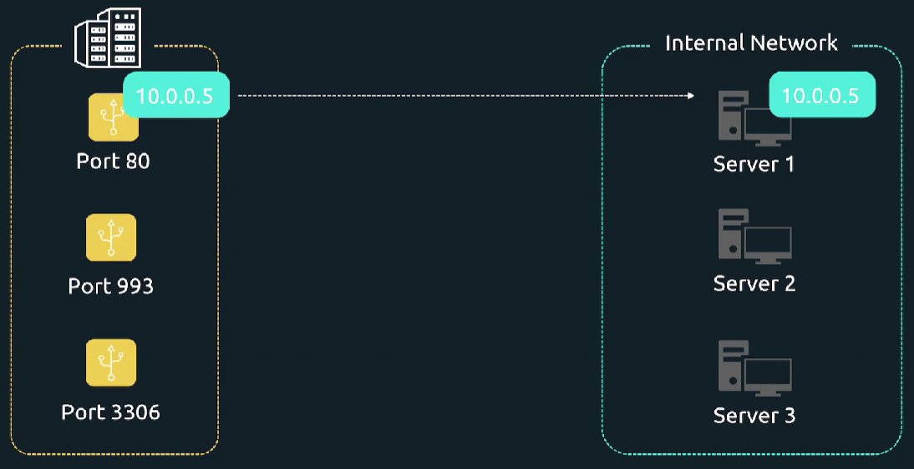

### Port Redirection (Port Forwarding)

<br>

Есть публичный сервер, доступный из интернета (в центре картинки) и есть хосты, находящиеся во внутренней сети. Можно настроить Port Forwarding так, чтобы запрос, пришедший на наш публичный сервер, например на порт 80, перенаправлялся на Server 1.

Структура сетевого пакета:

<br>

### NAT

Предположим, некое устройство в интернете с IP-адресом `203.0.113.1` (source address) отправляет данные на наш публичный север с IP-адресом `1.2.3.4` (destination address). Публичный сервер, получив сетевой пакет на порт 80, знает, что его нужно перенаправить на Server 1. В этот момент он начинает использовать Network Address Translation.

<br>

Изначально этот сетевой пакет, который должен быть перенаправлен, в качестве destination address имеет IP-адрес нашего публичного сервера `1.2.3.4`. Поэтому Server 1, имеющий IP-адрес `10.0.0.5`, подумает, что данные пакет ему не предназначен и просто проигнорирует его.

<br>

Поэтому наш публичный сервер подменяет destination address на IP-адрес Server 1 равный `10.0.0.5`.

Теперь Server 1 видит, что destination address в сетевом пакете соответствует его собственному IP-адресу и примет его.

Когда устройство подменяет destination или source address сетевого пакета, оно осуществляет *Network Address Translation*.

<br>

Однако на данном этапе source address сетевого пакета все еще равен `203.0.113.1`, и, когда Server 1 попытается отправить данные обратно, то не сможет этого сделать, т.к. находится в private-сети и не имеет выхода в интернет, а соответственно не сможет достучаться до адреса `203.0.113.1`.

Для решения этой проблемы наш публичный сервер может также подменять и source address. Вместо хранения `203.0.113.1` в качестве source address, он подменяет его на свой собственный IP-адрес `1.2.3.4`.

При таком подходе, когда Server 1 попытается ответить на перенаправленный пакет, то увидит, что отправляет данные на адрес `1.2.3.4`. И т.к. он у него есть связность с публичным сервером, операция будет завершена успешно.

Далее публичный сервер вернет ответ отправителю в интернете.

Когда машина манипулирует source-адресом (адресом отправителя), она, условно говоря, притворяется кем-то другим. Поэтому это техника часто называется **маскарадингом**.

Включить Port Forwarding на ОС Ubuntu можно двумя способами - отредактировать файл `/etc/sysctl.conf` либо файл `/etc/sysctl.d/99-sysctl.conf`.

По возможности лучше выбирать второй способ, т.к. при обновлении системных пакетов содержимое `/etc/sysctl.conf` может быть перезаписано.

```
# Для включения IPv4 forwarding-а раскомментируем
net.ipv4.ip_forward=1

# Для включения IPv6 forwarding-а раскомментируем
net.ipv6.conf.all.forwarding=1
```

Перечитываем параметры ядра командой: `sudo sysctl --system`.

Проверяем: `sudo sysctl -a | grep forward`.

Каждое правило firewall, каждый редирект, каждая операция трансляции сетевых адресов обрабатываются ядром Linux, а точнее его частью под названием *Netfilter Framework*.

Современной командой для взаимодействия с Netfilter Framework является `nft`. Однако nft-команды трудны для запоминания. Поэтому в наших примерах мы будем использовать iptables, который является предшественником nft. В большинстве дистрибутивов iptables-роли автоматически транслируются в nft-роли.

Рассмотрим сценарий, при котором весь трафик, приходящий от сети `10.0.0.0/24` на порт `8080` нашего публичного сервера, должен перенаправляться на порт `80` хоста Server 1, имеющего IP-адрес `192.168.0.5`. Публичный сервер имеет два сетевых интерфейса: `enp6s0` с IP-адресом `10.0.0.1/24` и `enp1s0` с IP-адресом `192.168.0.1/24`.

<br>