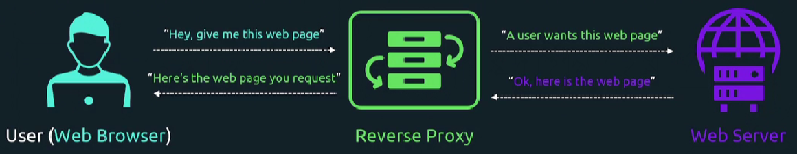
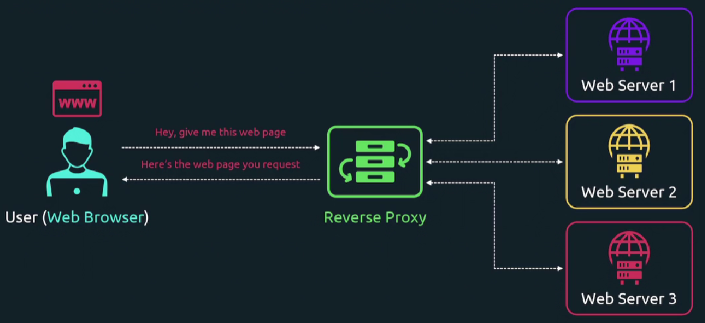
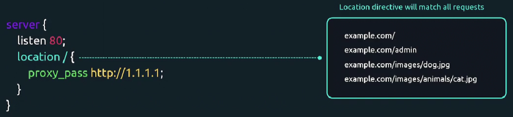

### Reverse Proxy

Пользователь обращается к Reverse Proxy, та в свою очередь запрашивает данные с веб-сервера. Веб-сервер возвращает данные Reverse Proxy, а она уже отдает контент пользователю.

<br>

Зачем вообще нужна Reverse Proxy? Предположим мы добавили в инфраструктуру новый более мощный веб-сервер. С помощью Reverse Proxy мы можем мгновенно переключить пользовательский трафик на новый веб-сервер.

Представим, что у нас бы не было Reverse Proxy. Тогда нам нужно было бы обновить DNS-запись для `example.com`, чтобы она указывала на IP-адрес нового веб-сервера.

*DNS propagation* — это процесс обновления кэша DNS-серверов по всему миру, который может занимать от нескольких минут до 72 часов.

Кроме того Reverse Proxy обладает и другими преимуществами - фильтрация веб-трафика, кэширование страниц для более быстрой отдачи контента пользователям и др.

### Load Balancing

Балансировка позволяет перенаправлять трафик сразу на несколько веб-серверов и динамически выбирать наиболее подходящий хост, например наименее загруженный (least busy).

<br>

### Nginx

Ставим nginx: `sudo apt install nginx`.

Создаем конфиг: `sudo vim /etc/nginx/sites-available/proxy.conf`.

```
server {
    listen 80;
    location / {
        proxy_pass http://1.1.1.1;
    }
}
```

<br>