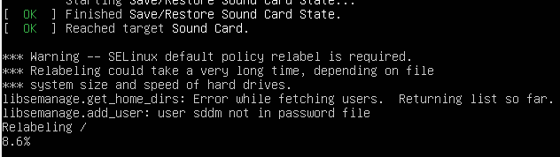

На ОС Ubuntu сначала отключаем сервис AppArmor: `sudo systemctl disable --now apparmor.service`.

Ставим необходимые пакеты: `sudo apt install selinux-basics auditd`.

Проверить включен ли SELinux: `sestatus`.

Включить SELinux: `sudo selinux-activate`.

При этом вносятся изменения в конфигурацию загрузчика `/etc/default/grub`:

```bash
GRUB_CMDLINE_LINUX=" security=selinux"
```

При этом в корне появляется файл `/.autorelabel`, который говорит системе, что нужно навесить на все файлы ОС метки SELinux.

Перезагружаем систему: `sudo systemctl reboot`.

Начнется процесс relabeling:

<br>

SELinux может работать в двух режимах - Permissive (разрешающий) и Enforcing.

В режиме Permissive ничего не запрещается, а только лишь логируется. Это своего рода режим, в котором SELinux обучается.

Посмотреть лог SELinux: `sudo audit2why --all | less`.

Рассмотрим например такую строку:

```
type=AVC msg=audit(1716488823.526:1068): avc:  denied  { execute_no_trans } for  pid=5357 comm="check-new-relea" path="/usr/bin/dpkg" dev="dm-0" ino=524574 scontext=system_u:system_r:sshd_t:s0-s0:c0.c1023 tcontext=system_u:object_r:dpkg_exec_t:s0 tclass=file permissive=1
        Was caused by:
                Missing type enforcement (TE) allow rule.

                You can use audit2allow to generate a loadable module to allow this access.
```

AVC - Access Vector Cache. Действие, которое было обнаружено в Permissive-режиме, в нормальном режиме будет запрещено. Процесс с меткой `sshd_t` попытался сделать что-то, что ему не разрешено.

Посмотрим какие процессы имеют метку `sshd_t`:

```bash
aidar@xubuntu-vm:~$ ps -eZ | grep sshd_t
system_u:system_r:sshd_t:s0-s0:c0.c1023 689 ?    00:00:00 sshd
system_u:system_r:sshd_t:s0-s0:c0.c1023 117652 ? 00:00:00 sshd
system_u:system_r:sshd_t:s0-s0:c0.c1023 117661 ? 00:00:00 sshd
system_u:system_r:sshd_t:s0-s0:c0.c1023 117683 ? 00:00:00 sshd
system_u:system_r:sshd_t:s0-s0:c0.c1023 117707 ? 00:00:00 sshd
```

Посмотрим какую метку имеет исполняемый файл `/usr/sbin/sshd`:

```bash
aidar@xubuntu-vm:~$ ls -Z /usr/sbin/sshd
system_u:object_r:sshd_exec_t:s0 /usr/sbin/sshd
```

Когда SELinux запускает что-либо с меткой `sshd_exec_t`, процесс перейдет в домен с меткой `sshd_t`.

Домен представляет собой некий "security bubble", содержащий внутри этот процесс, и позволяющий ему делать только то, что определено в рамках type `sshd_t`.