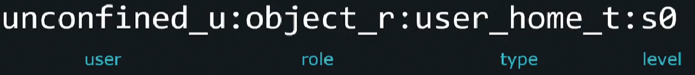
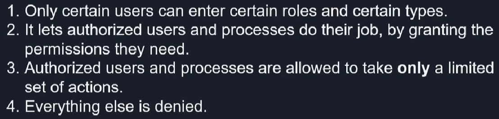

Смотреть контекст SELinux для файла: `ls -Z`.

Структура контекста SELinux - `user:role:type:level`.

<br>

Каждый пользователь, который залогинился в систему, маппится на пользователя SELinux как часть конфигурации политики SELinux. Пользователь ОС и пользователь SELinux - это разные сущности.

Когда маппинг пользователя определен, принимается решение, может ли он брать на себя роль. Каждый пользователя может брать на себя только предопределенный набор ролей. Представим например пользователя `developer_u`, который может использовать роли `developer_r`, `docker_r`.

Если пользователю разрешено брать на себя роль, далее выполняется проверка может ли роль перейти в type. Type похоже на некую защитную тюрьму для ПО. Как только кто-либо перешел в заданный type enforcement, он сможет делать только предопределенные вещи и ничего более. Этот "security bubble" называется *type*, если речь идет о файлах и *domain*, если речь идет о процессах.

Таким образом достигаются следующие важные цели:

<br>

Самая важная часть контекста SELinux это *type* или *domain*. А вот *level* чаще всего не используется в обычных системах.

Смотреть контекст SELinux для процессов: `ps axZ`.

Рассмотрим процесс `sshd`. Только файлы с меткой `sshd_exec_t` могут "входить" в домен `sshd_t`.

```bash
ps axZ | grep sshd
system_u:system_r:sshd_t:s0-s0:c0.c1023 11732 ?  Ss     0:00 /usr/sbin/sshd -D ...

ls -Z /usr/sbin/sshd
system_u:object_r:sshd_exec_t:s0 /usr/sbin/sshd
```

Только файлы, помеченные определенным type, могут запускать процессы, способные переключаться в определенный domain.

Любой процесс, имеющий метку `unconfined_t` запускается без каких-либо ограничений.

Смотреть контекст SELinux для процесса с PID=2: `sudo ps -Z -p 2`.

Смотреть контекст SELinux для текущего пользователя: `id -Z`.

Смотреть маппинг пользователя ОС на пользователя в SELinux: `sudo semanage login -l`.

```bash
sudo semanage login -l

Login Name           SELinux User         MLS/MCS Range        Service

__default__          unconfined_u         s0-s0:c0.c1023       *
root                 unconfined_u         s0-s0:c0.c1023       *
```

Здесь `__default__ ` любой обычный пользователь ОС.

Смотреть какие роли SELinux могут иметь пользователи SELinux в системе: `sudo semanage user -l`.

```bash
sudo semanage user -l

                Labeling   MLS/       MLS/
SELinux User    Prefix     MCS Level  MCS Range                      SELinux Roles

guest_u         user       s0         s0                             guest_r
root            user       s0         s0-s0:c0.c1023                 staff_r sysadm_r system_r unconfined_r
staff_u         user       s0         s0-s0:c0.c1023                 staff_r sysadm_r unconfined_r
sysadm_u        user       s0         s0-s0:c0.c1023                 sysadm_r
system_u        user       s0         s0-s0:c0.c1023                 system_r unconfined_r
unconfined_u    user       s0         s0-s0:c0.c1023                 system_r unconfined_r
user_u          user       s0         s0                             user_r
xguest_u        user       s0         s0                             xguest_r
```

Смотреть статус работы SELinux: `getenforce`.

Временно изменить контекст SELinux для файла: `sudo chcon -t httpd_sys_content_t /var/index.html`.

Временно изменить режим работы SELinux на Permissive: `sudo setenforce 0`.

Установить пакеты SELinux: `sudo yum install selinux*`.

Конфигурационный файл SELinux: `/etc/selinux/config`.

Отключить SELinux на постоянной основе: `SELINUX=disabled`.