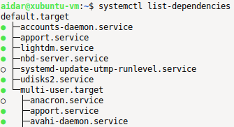

`tmpfs`  - виртуальная файловая система, которая живет в оперативной памяти сервера, не на дисках.

Смотреть сколько места занимает директория: `du -sh /bin/`.

Здесь `s = summarized-view`, `h = human-readable`. Без опции `s` отобразит место занятое каждым подкаталогом.

Смотреть информацию по доступной RAM: `free -h`.

Результат отображается в Gi/Mi. Доступная память отображается в столбце `available`, а не `free`.

Смотреть информацию по доступной RAM в мегабайтах (а не в мебибайтах): `free --mega`.

Смотреть нагрузку на CPU: `uptime`.

Смотреть информацию по CPU: `lscpu`.

Смотреть информацию о PCI-устройствах: `lspci`.

Проверить на ошибки и вылечить ФС xfs: `sudo xfs_repair -v /dev/vdb1`.

Проверить на ошибки и вылечить ФС ext4: `sudo fsck.ext4  -v -f -p /dev/vdb2`.

Здесь `v = verbose`, `f = force-check` - выполнить проверку, даже если ФС "здорова", `p = preen` - автоматически лечить простые проблемы без лишних вопросов.

Смотреть статус сервисов: `systemctl list-dependencies`.

 

Зеленым цветом отмечены работающие сервисы, белым - неактивные сервисы.
