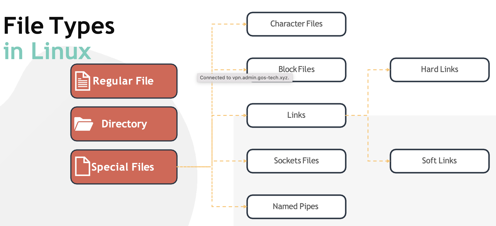
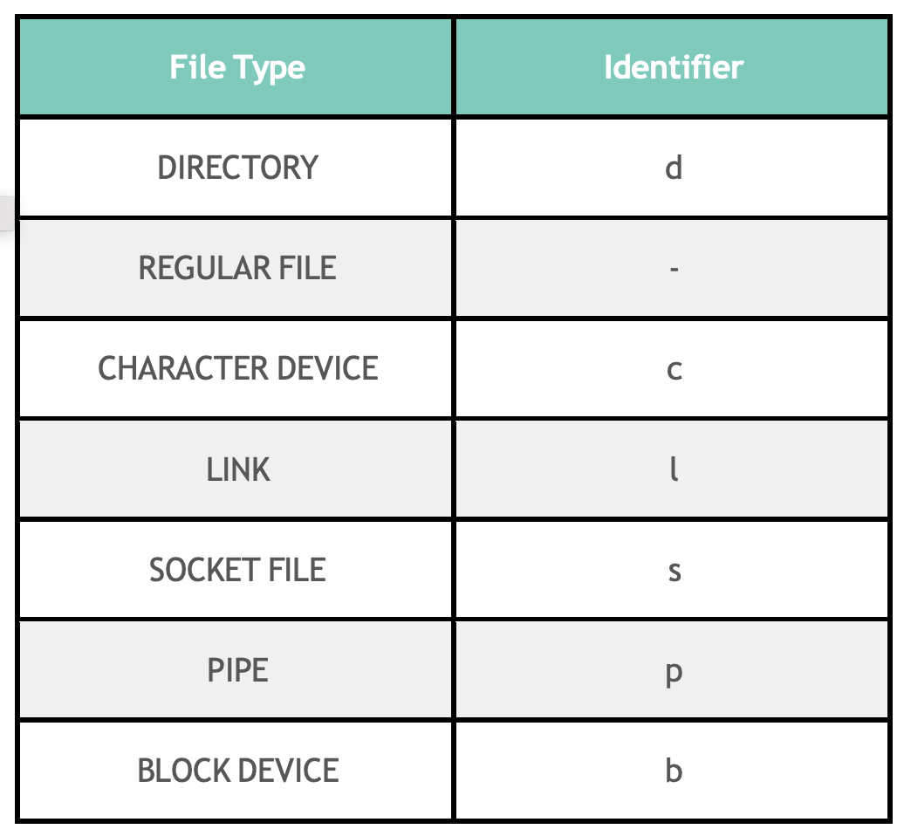

 

- Character Files, отражают устройства в ФС `/dev`, позволяют ОС последовательно коммуницировать с IO-устройствами (mouse, keyboard)
- Block Files, жесткие диски и RAM
- Socket Files, позволяет взаимодействовать двум процессам в системе
- Named Pipes, позволяет одному процессу подключаться в качестве input к другому процессу

Смотреть тип файла: `file /home/bash-script.sh` или `ls -l`.

 