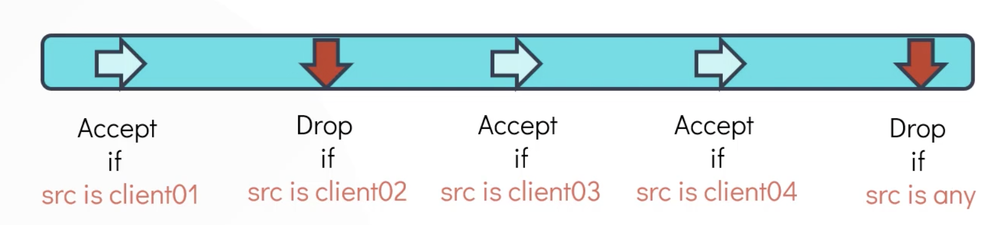

Установить iptables на Ubuntu: `sudo apt install iptables`.

Смотреть правила iptables: `iptables -L`.

```bash
Chain INPUT (policy ACCEPT)
target     prot opt source               destination

Chain FORWARD (policy ACCEPT)
target     prot opt source               destination

Chain OUTPUT (policy ACCEPT)
target     prot opt source               destination
```

- Chain INPUT - входящий трафик, например чтобы разрешить входящие ssh-подключения, нужно создать здесь правило
- Chain OUTPUT - исходящий трафик, подключения инициированные хостом к другим системам
- Chain FORWARD - обычно используется маршрутизаторами, когда данные перенаправляются другим устройствам в сети

Политика по умолчанию ACCEPT разрешает любой входящий и исходящий трафик.

Каждая цепочка (chain) имеет несколько правил внутри. Chain of rules.

Каждое правило осуществляет проверку и принимает или отбрасывает пакет, основываясь на условии.

<br>

То есть, если пакет удовлетворяет условию, тогда он будет либо принят либо отброшен, в зависимости от правила.

Если же пакет не удовлетворяет условию, тогда он будет передан на проверку следующему правилу в цепочке.

Также мы можем настраивать правила таким образом, чтобы в качестве условия рассматривался destination трафика.

Добавим правило на хост devapp01 (ip 172.16.238.10), разрешающее входящее ssh-подключение с клиентской машины:

`iptables -A INPUT -p tcp -s 172.16.238.187 --dport 22 -j ACCEPT`, где

- `-A` - Add Rule
- `-p` - Protocol
- `-s` - Source
- `-d` - Destination
- `--dport` - Destination Port
- `-j` - Action to take

Что теперь произойдет, если другой клиент попытается подключиться по ssh к хосту devapp01? Т.к. у нас нет отдельного правила для этого случая, то подключение попытается пройти через дефолтную политику, которая принимает все входящие подключения.

Мы же хотим, чтобы только определенные клиенты могли подключаться по ssh к нашему хосту. Поэтому нам нужно создать другое INPUT-правило:

`iptables -A INPUT -p tcp --dport 22 -j DROP`.

Последовательность, в которой добавляются правила очень важна, т.к. они выполняются сверху вниз. То есть применяется первое правило из списка, которое удовлетворяет заданному условия, все остальные игнорируются.

Добавим оставшиеся правила на хост devapp01. Нужно разрешить исходящие подключения к серверу БД devdb01 (ip 172.16.238.11) по порту 5432, к репозиторию caleston-repo-01 (ip 172.16.238.15) по порту 80, запретить исходящий трафик в интернет по портам 80/443, разрешить входяший трафик по порту 80 от клиента caleston-lp10 (ip 172.16.238.187).

```bash
iptables -A OUTPUT -p tcp -d 172.16.238.11 --dport 5432 -j ACCEPT   #к БД
iptables -A OUTPUT -p tcp -d 172.16.238.15 --dport 80 -j ACCEPT     #к repo
iptables -A OUTPUT -p tcp --dport 80 -j DROP                        #запрет до интернета
iptables -A OUTPUT -p tcp --dport 443 -j DROP                       #запрет до интернета
iptables -A INPUT -p tcp -s 172.16.238.187 --dport 80 -j ACCEPT     #от клиента
```

Предположим теперь нам нужно разрешить исходящие подключения к сайту `caleston-hq.com` (ip 172.16.238.100).

Если мы добавим его через опцию `-A`, тогда оно будет помещено "на дно" цепочки, и вышестоящие правила, запрещающие весь исходящий в интернет трафик, будут иметь над ним более высокий приоритет и ничего не сработает. Поэтому нужно использовать опцию `-I`, которая добавит правило на вершину цепочки:

`iptables -I OUTPUT -p tcp -d 172.16.238.100 --dport 443 -j ACCEPT`.

Удалить правило: `iptables -D OUTPUT 5`, где указывается из какой цепочки удалить правило, и номер правила в цепочке.

Смотреть правила с их номерами: `iptables -L --line-numbers`.

Теперь настроим iptables на сервере БД:

```bash
iptables -A INPUT -p tcp -s 172.16.238.10 --dport 5432 -j ACCEPT   #принимать от devapp01
iptables -A INPUT -p tcp --dport 5432 -j DROP                      #дропать от всех остальных
```

Что происходит, когда устанавливается сессия между хостами devapp01 и devdb01? Должны ли мы создать INPUT-правило на сервере devapp01, разрешающее возвращающийся от БД трафик? В данном случае ответ - нет. После установления сессии трафик от сервера БД возвращается на сервер devapp01 на рандомный ephemeral TCP-порт (например 44060). Для проверки можно использовать команду: `netstat -an | grep 5432` на одном из хостов.

Согласно произведенным ранее настройкам, хост devapp01 принимает любой входящий трафик, кроме 22/tcp. Соответственно нет необходимости создавать отдельное правило для обратного трафика от сервера БД.

Блокировать любой входящий трафик: `iptables -A INPUT -j DROP`.

Сохранить правила iptables на постоянной основе в RPM-based системе: `iptables-save > /etc/sysconfig/iptables`.

Или из документации RedHat: `/sbin/service iptables save`.

This executes the `iptables` initscript, which runs the `/sbin/iptables-save` program and writes the current iptables configuration to `/etc/sysconfig/iptables`. The existing `/etc/sysconfig/iptables` file is saved as `/etc/sysconfig/iptables.save`. 
