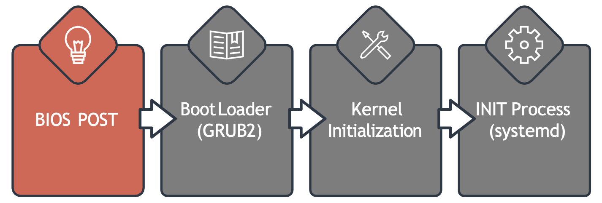

Процесс загрузки Linux может быть разделен на четыре этапа:

 

- POST (Power-On Self-Test), на этом этапе BIOS запускает POST тест, чтобы убедиться, что все добавленные в систему устройства работают корректно.
- Boot Loader (GRUB2), после успешного прохождения POST теста BIOS загружает и исполняет загрузочный код из загрузочного устройства, который находится в первом секторе жесткого диска. В Linux загрузчик находится в ФС `/boot`. Загрузчик предоставляет пользователю экран загрузки с вариантами загрузки.
- Kernel Initialization, когда сделан выбор, загрузчик загружает ядро в память, снабжая его некоторыми параметрами и передает контроль процессом загрузки ядру. После того как выбранное ядро загружено в память, оно распаковывается, т.к. обычно ядро поставляется в заархивированном виде для экономии места. После загрузки ядра в память оно начинает выполняться. В этот момент ядро выполняет задачи по инициализации железа, управлению памятью и др.
- INIT Process (sytemd), когда ядро полностью готово, оно запускает процесс init, который в свою очередь подготавливает User Space и процессы необходимые для пользовательского окружения. Функция init затем вызывает демон systemd, который отвечает за приведение Linux хоста в рабочее состояние. Systemd отвечает за монтирование ФС, запуск и управление системных служб.

Чтобы проверить какая init система используется: `ls -l /sbin/init`.