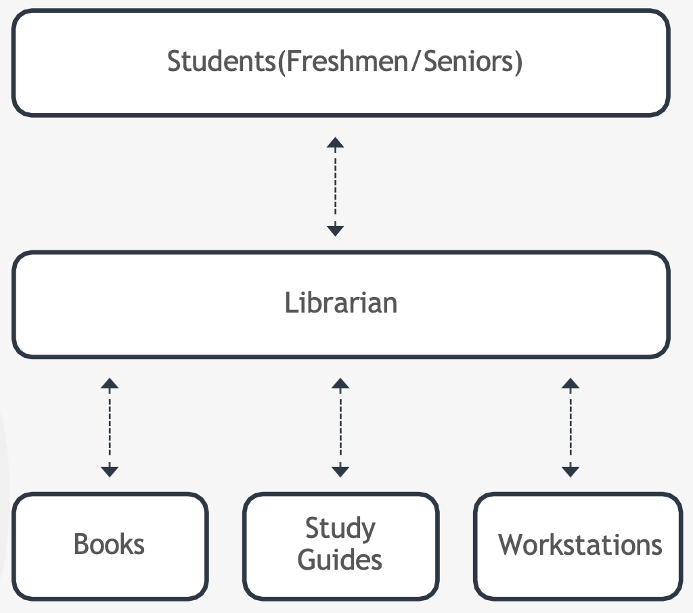

Ядро Linux - ключевой интерфейс между железом компьютера и его процессами.

 

Для понимания можно использовать аналогию с библиотекой в колледже. Библиотека имеет в своем распоряжении некоторое **ограниченное** количество ресурсов - книги, учебные пособия, DVD, компьютеры и пр. Эти ресурсы используются студентами. Ключевое лицо здесь - библиотекарь. Представим, что бы было без библиотекаря. Кучки снующих из угла в угол студентов, которые берут любые книги, до которых могут дотянуться. Непонятно кто какую книгу взял и когда она будет возвращена. Такая неуправляемая система может привести к тому, что невозвращенные в срок книги будут недоступны студентам, которые в них реально нуждаются.

Добавим библиотекаря. Он контролирует, что студенты берут книги в соответствии с годом обучения, выдавая при этом одну книгу на студента. Следит за всеми выданными книгами и датами их возвращения. Рассылает уведомления студентам перед наступлением даты возвращения книги. Убеждается, что книги возвращены и в дальнейшем могут быть использованы другими студентами.

 

В приведенной аналогии библиотека - это ОС. Книги, учебные пособия, DVD, компьютеры - это "железные" ресурсы. Студенты - процессы приложения. Библиотекарь - ядро Linux.

Ядро отвечает за четыре главные задачи:
- Memory Management - отслеживает, сколько памяти используется для хранения чего и где
- Process Management - определяет, какие процессы могут использовать CPU, когда и как долго
- Device Drivers - выступает в роли посредника между железом и процессами
- System Calls and Security - получает запросы на обслуживание от процессов

Ядро является монолитным. Это означает, что ядро выполняет планировку ресурсов CPU, управление памятью и други операции самостоятельно.

Ядро также является модульным. Это означает, что ядро может расширять свои возможности через использование динамически загружаемых модулей ядры.

Смотреть информацию о ядре: `uname -r` или `uname -a`.

Например мы получили вывод команды: `4.15.0-72-generic`.

- 4 - Kernel Version
- 15 - Major Version
- 0 - Minor Version
- 72 - Patch Release
- Generic - Distro Specific Info

Как уже говорилось ранее, одной из важных функций ядра является управление памятью.

Память разделяется на две области - Kernel Space и User Space.

Kernel Space - область памяти, в которой ядро выполняет собственные сервисы. Процесс, запущенный в Kernel Space имеет неограниченный доступ к железу. Пространство строго ограничено для запуска кода ядра, расширений ядра и большинства драйверов устройств.

Возвращаясь к нашей аналогии, Kernel Space можно сравнить со служебным помещением в библиотеке, доступ к которому имеет только администратор или билиотекарь.

Все процессы запущенные вне ядра находятся в User Space, которое имеет ограниченный доступ к CPU и памяти.

User Space (или User Land) можно сравнить с помещением библиотеки, выделенным для студентов, и предназначенным для работы с книгами.

Рассмотрим как работают программы запущенные в User Space. Все пользовательские программы функционируют путем манипулирования данными. Данные как правило живут на диске или в памяти. Программы получают доступ к этим данным с помощью специльных запросов к ядру, называемых системными вызовами. Например выделение памяти для переменных или открытие файла.

Возвращаясь к аналогии студенты делают запрос библиотекарю на выдачу книги из определенной секции библиотеки. Книга будет выдана только если библиотекарь одобрит выдачу.

Пример - открытие файла /etc/os-release.

 

Варианты системных вызовов:
- open()
- close()
- readdir()
- strlen()
- closedir()