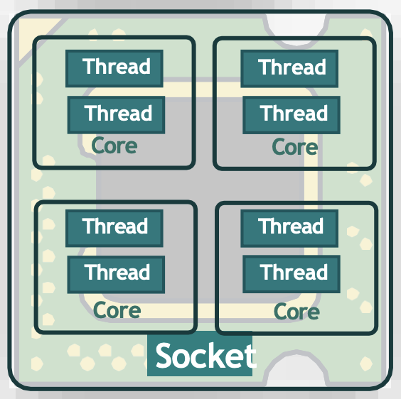

Рассмотрим пример использования USB-флешки в Linux системе.

Как только девайс подключили к системе, соответствующий драйвер устройства, который является частью Kernel Space, определяет изменение и генерирует событие. Это событие, которое называется uevent, посылается в User Space к демону управления устройствами под названием udev. Сервис udev отвечает за динамическое создание ноды устройства, ассоциированного с новым подключенным диском в ФС /dev.

<br>

Утилита `dmesg -T` используется для отображения сообщений из области ядра, называемой ring buffer. В процессе загрузки ОС Linux ядро генерирует многочисленные сообщения, которые появляются на экране.

Утилита `udevadm` предназначена для управления udev.

Команда `udevadm info --query=path --name=/dev/sda5` делает запрос в БД udev для получения информации об устройстве.

Команда `udevadm monitor` слушает события ядра uevents. Она очень удобна для определения деталей о вновь подключенных либо удаленных устройствах.

Команда `lspci` позволяет получить информацию обо всех PCI-устройствах в системе.

Команда `lsblk` позволяет получить информацию о блочных устройствах в системе.

<br>

Число MAJ (major) определяет тип драйвера ассоциированного с устройством. В примере число 8 относится к блочному устройству sdisk.

Число MIN (minor) используется для разделения среди идентичных устройств, которые используют одинаковое значение MAJ.

<br>

Команда `lscpu` позволяет получить информацию о процессорах в системе. Разберем некоторые значение:

```
Architecture:            x86_64
  CPU op-mode(s):        32-bit, 64-bit
  Address sizes:         39 bits physical, 48 bits virtual
  Byte Order:            Little Endian
CPU(s):                  6   #количество одновременных параллельных потоков, оно же итоговое количество CPU
  On-line CPU(s) list:   0-5
Vendor ID:               GenuineIntel
  Model name:            Intel(R) Core(TM) i7-9750H CPU @ 2.60GHz
    CPU family:          6
    Model:               158
    Thread(s) per core:  1   #каждое ядро может запускать несколько потоков одновременно, их число
    Core(s) per socket:  6   #количество ядер на процессор
    Socket(s):           1   #количество физических слотов на материнской плате, в которые можно установить процессор
```

<br>

Итоговое количество CPU или virtual CPUs доступное в системе считается по формуле: Sockets x Cores x Threads = CPUs.

Команда `lsmem --summary` позволяет получить информацию о количестве доступной в системе памяти.

Команда `lshw` позволяет получить информацию по всему доступному железу.