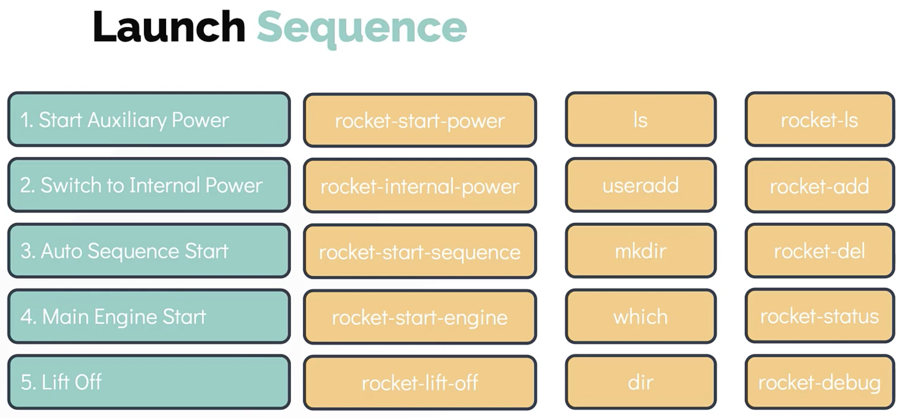

<br>

```bash
rocket-add mission-name
rocket-start-power mission-name
rocket-internal-power mission-name
rocket-start-sequence mission-name
rocket-start-engine mission-name
rocket-lift-off mission-name
rocket-status mission-name
```